<p align="center">
  
</p>

<h1 align="center">SeuraPlay</h1>

<p align="center">
  <strong>A modern, privacy-focused TV Show and Movie tracker built with Flutter.</strong><br>
  Track your watched series, discover upcoming releases, climb Cinephile XP ranks, and keep your data safe with Google Drive.
</p>

<p align="center">
  <a href="https://github.com/Ankit-692/seuraplay/releases">
    
  </a>
  
  
  
</p>

---

## 📖 Table of Contents

- [About SeuraPlay](#-about-seuraplay)
- [Download & Installation (For Users)](#-download--installation-for-users)
- [App Screenshots](#-app-screenshots)
- [Key Features](#-key-features)
- [How It Works (Under the Hood)](#-how-it-works-under-the-hood)
- [Developer Guide (Building from Source)](#-developer-guide-building-from-source)
  - [Prerequisites](#prerequisites)
  - [Acquiring API Keys & Credentials](#acquiring-api-keys--credentials)
  - [Step-by-Step Installation](#step-by-step-installation)
  - [Running the App](#running-the-app)
  - [Release Build & Android Signing](#release-build--android-signing)
- [Tech Stack](#-tech-stack)
- [Privacy & Security](#-privacy--security)
- [License](#-license)

---

## 🌟 About SeuraPlay

**SeuraPlay** is a personal media tracking application crafted for TV show and movie lovers who care about **privacy**, **design**, and **data ownership**.

Most modern tracking apps lock your watch history behind mandatory user accounts, inundate you with advertisements, or sell your viewing habits to third-party data brokers. SeuraPlay takes a different path:

- 🔒 **100% Offline-First & Private**: All your data lives directly on your device in a fast, local SQLite database. No mandatory sign-ups, no tracking cookies, and zero advertisements.
- ☁️ **Private Google Drive Sync**: When you want cross-device backup, SeuraPlay syncs directly to a hidden, restricted folder in your personal Google Drive (`appDataFolder`). Only your app can read it.
- 🎨 **AMOLED Dark Aesthetic**: Designed from the ground up with deep blacks, fluid navigation, and a modern glassmorphic interface.
- 🎮 **Gamified Viewing**: Turn your hobby into an experience with Cinephile XP points, genre diversity bonuses, and viewer ranks.

---

## 📥 Download & Installation (For Users)

The fastest and easiest way to use SeuraPlay on your Android phone or tablet:

<p align="center">
  <a href="https://github.com/Ankit-692/seuraplay/releases">
    
  </a>
</p>

### Simple Installation Steps:
1. Open the [**GitHub Releases Page**](https://github.com/Ankit-692/seuraplay/releases).
2. Download the latest `seuraplay.apk` file under the **Assets** section of the latest release.
3. Open the downloaded APK on your Android device:
   - If prompted with *"For your security, your phone is not allowed to install unknown apps"*, tap **Settings** and toggle **Allow from this source**.
   - Tap **Install**.
4. Launch SeuraPlay and enjoy your distraction-free tracker!

---

## 📱 App Screenshots

<div align="center">

### 📺 TV Shows Management
| Shows (Grid View) | Shows (List View) | Completed Shows | Dropped Shows |
| :---: | :---: | :---: | :---: |
| 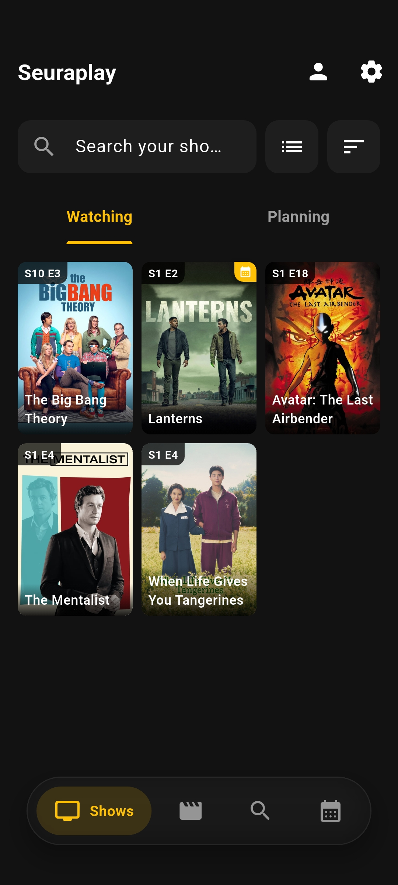 | 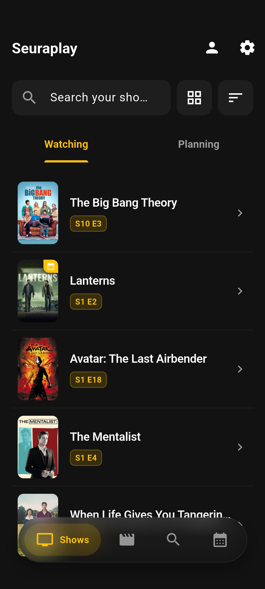 | 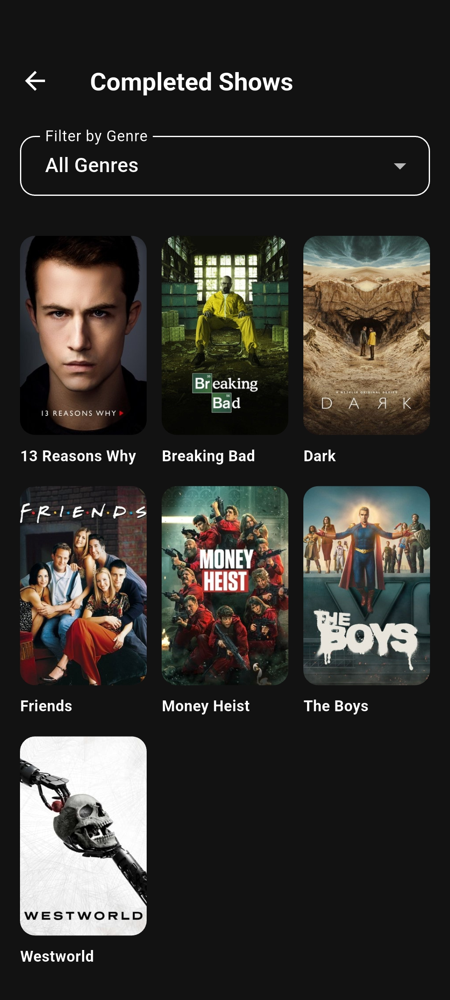 | 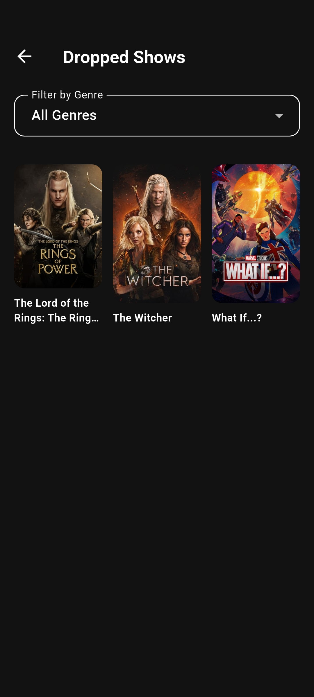 |

<br>

### 🎬 Movies & Release Radar
| Movies (Grid View) | Movies (List View) | Completed Movies | Upcoming Release Radar |
| :---: | :---: | :---: | :---: |
| 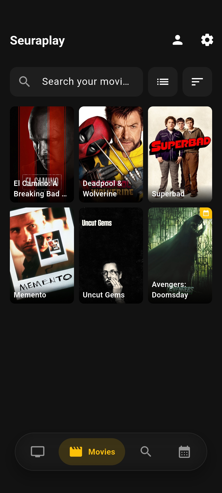 | 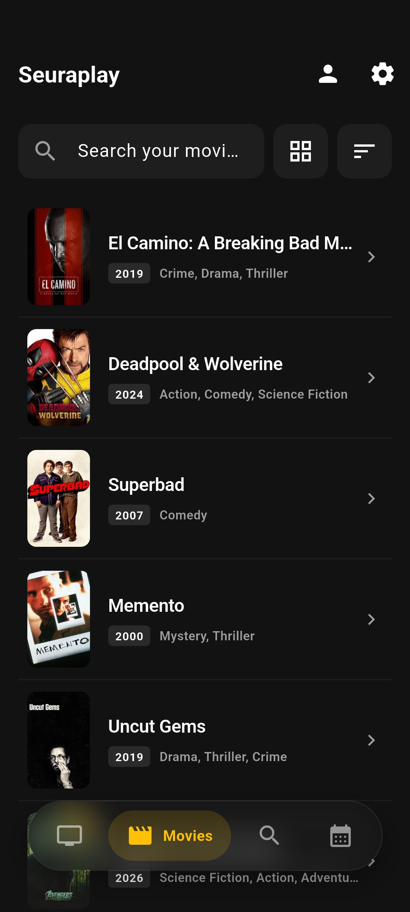 | 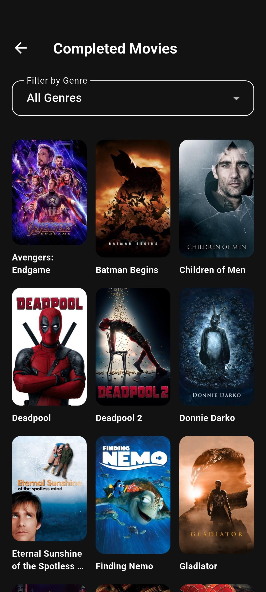 | 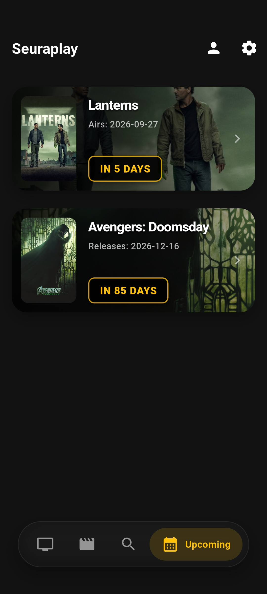 |

<br>

### 🔍 Discovery & Cinephile XP Progression
| Search & Discover | Live Search Results | Profile (Explorer Rank) | Profile (Enthusiast Rank) |
| :---: | :---: | :---: | :---: |
| 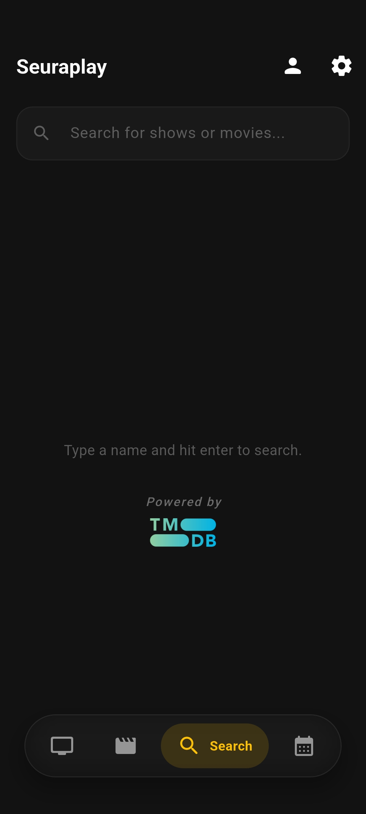 | 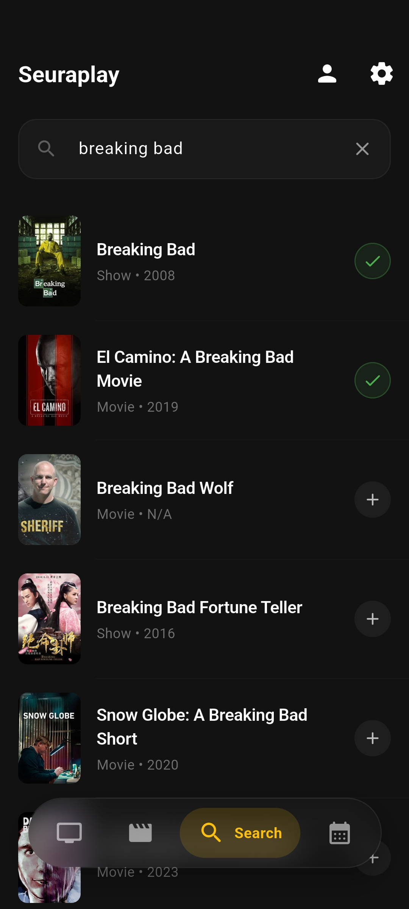 | 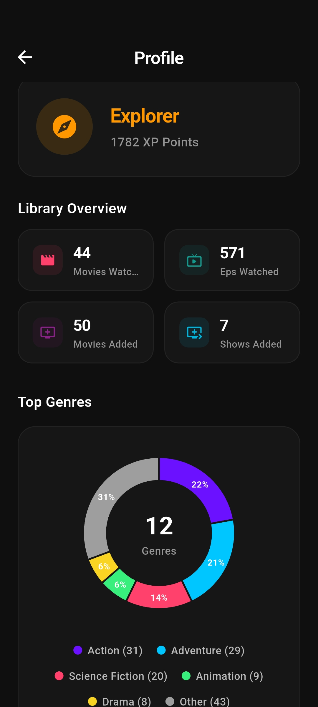 | 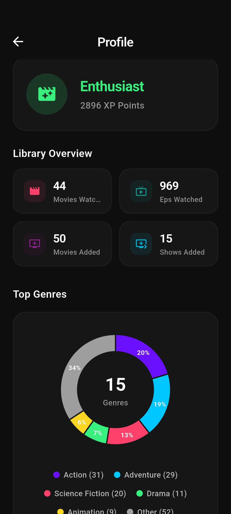 |

</div>

---

## ✨ Key Features

### 🎬 TV Show & Movie Tracking
- **Granular Status Categories**: Organize titles by **Watching**, **Planning**, **Completed**, and **Dropped**.
- **Interactive Episode Checklist**: Expandable season accordions with individual checkboxes, air dates, and one-tap season completion.
- **Visual Progress**: Real-time progress bars showing watched vs. total episodes across your entire library.
- **Official Trailers & Cast**: Instant playback of YouTube trailers and a cast carousel with character names and headshots.

### 🔍 Instant Search & Rich Previews
- **Fast TMDB Search**: Live, debounced search across thousands of movies and TV series.
- **Search Preview Screen**: Review synopsis, cast, genres, ratings, and seasons *before* committing an item to your library.
- **In-Library Search & Sorting**: Quick filter your library by title or sort by **Recently Added** or **Alphabetical**.
- **Grid / List View Switcher**: Choose between an immersive movie poster grid or a compact list view.

### 📅 Upcoming Releases & Countdown Radar
- **Release Radar**: Dedicated tab that monitors release dates for movies and new episodes of shows in your library.
- **Smart Countdown Badges**: Color-coded badges alerting you to titles airing **TODAY**, **TOMORROW**, or **IN X DAYS**.

### 📊 Cinephile Profile & XP Ranks
- **Dynamic XP System**: Earn points as you watch:
  - **10 XP** per movie watched
  - **1 XP** per episode checked off
  - **50 XP** per completed series
  - **Diversity Multiplier**: Up to **2.0x bonus** for exploring varied genres.
- **Viewer Ranks**: Climb from **Novice Viewer** → **Explorer** → **Enthusiast** → **Connoisseur** → **Cinephile** → **Master Viewer**.
- **Interactive Genre Distribution**: Visual breakdown of your taste powered by `fl_chart`.
- **Dropped Shows Archive**: Dedicated collection to review or resume shows you previously paused.

### 💾 Backup, Recovery & Data Sovereignty
- **Google Drive Cloud Sync**: Effortless one-tap cloud backup and daily automated background sync to your personal Google account.
- **Offline File Export/Import**: Export raw database files to your local storage to keep offline copies or move across devices without internet.
- **Multi-Device Safeguards**: Built-in reminders and safeguards against overwriting backups when using multiple devices.

### 🎨 Clean Dark UI
- Built with a true AMOLED dark theme (`#0F0F0F`) for battery savings and comfortable night viewing.
- Floating glassmorphic bottom navigation bar with real-time backdrop blur.

---

## ⚙️ How It Works (Under the Hood)

For tech-minded users and curious developers, here is how SeuraPlay functions internally:

```
                          ┌─────────────────────────────┐
                          │   Flutter UI (Presentation) │
                          │ (AMOLED Dark / Riverpod UI) │
                          └──────────────┬──────────────┘
                                         │ Watch / Read
                                         ▼
                          ┌─────────────────────────────┐
                          │   Riverpod State Management │
                          │  (Controllers, Streams)     │
                          └──────────────┬──────────────┘
                                         │
                 ┌───────────────────────┴───────────────────────┐
                 ▼                                               ▼
   ┌───────────────────────────┐                   ┌───────────────────────────┐
   │    Local Drift SQLite     │                   │     TMDB REST API v3      │
   │  (Shows, Movies, Seasons, │                   │  (Search, Details, Cast,  │
   │   Episodes, Watch Status) │                   │    Trailers, Upcoming)    │
   └─────────────┬─────────────┘                   └─────────────┬─────────────┘
                 │                                               │
                 │              ┌─────────────────┐              │
                 ├─────────────►│   SyncService   │◄─────────────┘
                 │              │ (24h Auto-Sync) │
                 │              └────────┬────────┘
                 │                       │
                 ▼                       ▼
   ┌───────────────────────────┐   ┌───────────────────────────┐
   │    Local Storage Export   │   │  Google Drive AppData API │
   │   (Manual SQLite Export)  │   │  (Silent Cloud Backups)   │
   └───────────────────────────┘   └───────────────────────────┘
```

1. **Drift SQLite Core**: Media records, season trees, and episode watch states are persisted in a local SQLite file (`db.sqlite`). Drift streams deliver real-time reactive updates to the UI without page refreshes.
2. **TMDB REST API**: Requests are dispatched through an authenticated `Dio` client to TMDB endpoints.
3. **Daily Sync Engine**: On app launch, `SyncService` checks if 24 hours have elapsed since the last sync. If auto-backup is enabled, it pulls newly aired episodes/seasons for active shows and uploads an updated database snapshot to Google Drive.
4. **Isolated Drive AppData**: Backups utilize Google's restricted `drive.appdata` scope, placing files in a secure directory hidden from normal Google Drive search and file browsing.

---

## 🛠 Tech Stack

| Component | Library / Tool | Purpose |
| :--- | :--- | :--- |
| **Framework** | [Flutter 3.x](https://flutter.dev/) (Dart 3) | Cross-platform UI toolkit |
| **State Management** | [Riverpod](https://riverpod.dev/) (`flutter_riverpod`) | Reactive state handling and dependency injection |
| **Local Database** | [Drift](https://drift.simonbinder.eu/) + `sqlite3_flutter_libs` | High-performance, type-safe SQLite database |
| **Network Client** | [Dio](https://pub.dev/packages/dio) | REST API requests & Bearer auth to TMDB |
| **Cloud Backups** | [googleapis](https://pub.dev/packages/googleapis) (`drive:v3`) | Google Drive AppData folder sync |
| **Authentication** | [google_sign_in](https://pub.dev/packages/google_sign_in) | Google OAuth 2.0 authentication |
| **Charts** | [fl_chart](https://pub.dev/packages/fl_chart) | Dynamic pie and progress charts |
| **Local Files** | `file_picker`, `path_provider` | Exporting & importing SQLite backup files |
| **Code Generation** | `build_runner`, `drift_dev` | Generates database schema boilerplate |

---

## 💻 Developer Guide (Building from Source)

If you are a developer and wish to contribute, inspect the code, or compile SeuraPlay yourself, follow this guide:

### Prerequisites

- **Flutter SDK**: `^3.12.2` (Flutter 3.24+ recommended)
- **Dart SDK**: `^3.0.0`
- **JDK**: Java Development Kit 17 (Required by Android Gradle Plugin)
- **Android SDK & Build Tools**: Android Studio with API 34/35 installed
- **Git**

---

### Acquiring API Keys & Credentials

SeuraPlay requires two compile-time credentials passed via `--dart-define`:

#### 1. TMDB API Key / Access Token
1. Register for a free account at [The Movie Database (TMDB)](https://www.themoviedb.org/).
2. Head to **Settings > API** to generate your API credentials.
3. Copy your **API Read Access Token (v4)** or **API Key (v3)**.

#### 2. Google OAuth Credentials (for Google Drive Sync)

To enable Google Sign-In and Google Drive cloud backups, configure your project on the [Google Cloud Console](https://console.cloud.google.com/):

1. **Enable the Drive API**:
   - Go to **APIs & Services > Library**, search for **Google Drive API**, and click **Enable**.

2. **Configure the OAuth Consent Screen**:
   - Go to **APIs & Services > OAuth consent screen** and select **External**.
   - Fill in the required basic app details (App name: *SeuraPlay*, user support email).
   - Under **Scopes**, click **Add or Remove Scopes** and add:
     - `https://www.googleapis.com/auth/drive.appdata`
     - `email`, `profile`, `openid`
   - Under **Test users**, add your Google email address (mandatory while the GCP app is in *Testing* status).

3. **Get Your SHA-1 Certificate Fingerprint**:
   Google requires an SHA-1 fingerprint for your Android OAuth Client ID to authenticate the app package (`com.seuraplay.app`).

   - **For Debugging / Development**:
     Extract the SHA-1 from your default Flutter/Android debug keystore:
     ```bash
     # Linux / macOS
     keytool -list -v -keystore ~/.android/debug.keystore -alias androiddebugkey -storepass android -keypass android

     # Windows (Command Prompt)
     keytool -list -v -keystore "%USERPROFILE%\.android\debug.keystore" -alias androiddebugkey -storepass android -keypass android
     ```
     *(Alternatively, run `cd android && ./gradlew signingReport` from the project root).*

   - **For Production / Release Build**:
     Extract the SHA-1 from your release upload keystore:
     ```bash
     keytool -list -v -keystore /path/to/your/upload-keystore.jks -alias your_alias_name
     ```
     *(If you haven't created a release keystore yet, generate one with: `keytool -genkey -v -keystore ~/upload-keystore.jks -keyalg RSA -keysize 2048 -validity 10000 -alias upload`)*

4. **Create the Two OAuth 2.0 Client IDs** (under **APIs & Services > Credentials > Create Credentials > OAuth client ID**):
   - **A. Web Application Client ID (Used for `WEB_CLIENT_ID`)**:
     - Application type: **Web application**.
     - Name: `SeuraPlay Web Client`.
     - Authorized JavaScript origins / redirect URIs can be left blank.
     - Click **Create** and copy the generated **Client ID** (e.g., `xxxxxxxxxxxx-xxxxxxxxxxxxxxxx.apps.googleusercontent.com`). Pass this string to `--dart-define=WEB_CLIENT_ID=...`.
   - **B. Android Client ID (Required for on-device authentication)**:
     - Application type: **Android**.
     - Package name: `com.seuraplay.app`.
     - SHA-1 certificate fingerprint: Paste your **Debug SHA-1** (and create a second Android client ID with your **Release SHA-1** when building production releases).
     - Click **Create**.

---

### Step-by-Step Installation

1. **Clone the repository**:
   ```bash
   git clone https://github.com/Ankit-692/seuraplay.git
   cd seuraplay
   ```

2. **Install dependencies**:
   ```bash
   flutter pub get
   ```

3. **Generate Drift Database Code**:
   Drift requires generating code for `database.g.dart`:
   ```bash
   dart run build_runner build --delete-conflicting-outputs
   ```

---

### Running the App

Run the application on an emulator or physical device with your defined credentials:

```bash
flutter run \
  --dart-define=TMDB_API_KEY="YOUR_TMDB_ACCESS_TOKEN" \
  --dart-define=WEB_CLIENT_ID="YOUR_WEB_CLIENT_ID.apps.googleusercontent.com"
```

---

### Release Build & Android Signing

To compile a signed release APK:

1. Create a `key.properties` file inside the `android/` directory (git-ignored by default):
   ```properties
   storePassword=your_keystore_password
   keyPassword=your_key_password
   keyAlias=your_key_alias
   storeFile=/path/to/your/upload-keystore.jks
   ```

2. Ensure your release keystore's SHA-1 fingerprint is registered under your Google Cloud Android OAuth Client ID.

3. Build the release APK:
   ```bash
   flutter build apk --release \
     --dart-define=TMDB_API_KEY="YOUR_TMDB_ACCESS_TOKEN" \
     --dart-define=WEB_CLIENT_ID="YOUR_WEB_CLIENT_ID.apps.googleusercontent.com"
   ```

The compiled APK will be located at `build/app/outputs/flutter-apk/app-release.apk`.

---

## 📁 Project Structure

```
lib/
├── core/
│   ├── config/             # Compile-time constants (API keys)
│   ├── database/           # Drift SQLite database tables & migrations
│   ├── network/            # Dio client & TMDB repository
│   ├── services/           # SyncService & DriveBackupService
│   ├── theme/              # AMOLED dark theme styling
│   └── utils/              # Toast helpers & formatters
├── features/
│   ├── home/               # Main navigation container & floating nav bar
│   ├── intro/              # First-launch onboarding walkthrough
│   ├── library/            # Shows, Movies, Search, & Search Details screens
│   ├── movie_details/      # Movie overview, trailers, and cast carousel
│   ├── profile/            # Profile stats, XP ranks, genre chart, dropped shows
│   ├── settings/           # Local and Google Drive backup options
│   ├── show_details/       # Show overview, seasons accordion, episode checklists
│   └── upcoming/           # Upcoming releases radar & countdown badges
└── main.dart               # App entrypoint & 24h background sync trigger
```

---

## 🔒 Privacy & Security

- **Local Storage First**: All your data is kept exclusively on your device.
- **Drive AppData Isolation**: Google Drive backups are stored in a private, hidden folder (`drive.appdata`) that cannot be accessed by other applications.
- **No Third-Party Analytics**: No telemetry, tracking scripts, or ad networks are bundled.

---

## 📄 License

This project is licensed under a **Non-Commercial License**.

**You are free to:**
- Download, inspect, and compile the source code.
- Modify and customize the app for personal use.
- Share personal builds for non-commercial or educational purposes.

**You are strictly prohibited from:**
- Selling, distributing, or monetizing this application or its source code.
- Using this codebase or its branding for commercial services.